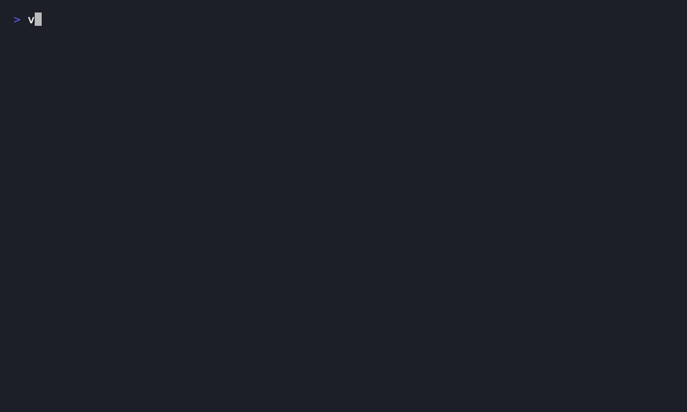

# vdisplay

[](LICENSE)


Self-owned virtual displays for macOS via the private `CGVirtualDisplay`
CoreGraphics API — the same mechanism BetterDisplay / BetterDummy / DeskPad use.
Drive resolutions and aspect ratios (e.g. 16:9) your physical monitor doesn't
natively offer. Free, no expiry, no paid tier.



Three pieces, all from one small codebase:

- **`vdisplay`** — command-line tool
- **`vdisplaybar`** — menu-bar app (toggle displays, auto-start at login, monitor layouts, brightness)
- **saved profiles** — JSON at `~/.config/vdisplay/profiles.json`

## Install

### Homebrew (recommended)

```sh
brew tap pacifistazero/tap
brew trust pacifistazero/tap   # recent Homebrew requires trusting third-party taps
brew install vdisplay
```

Then run the menu-bar app and register it to launch at login:

```sh
vdisplaybar &            # try it now
# auto-start at login is set up by the LaunchAgent installer below
```

### From source

```sh
scripts/install-launchagent.sh
```

This builds everything, installs `vdisplay` + `vdisplaybar` to `~/.local/bin`,
and registers the menu-bar app as a LaunchAgent so it starts at every login.
A display icon appears in your menu bar; click it to toggle any saved profile
on/off. The **Auto-start at Login** submenu marks which profiles come up
automatically when the app launches.

Uninstall the LaunchAgent with `scripts/uninstall-launchagent.sh`.

## CLI

```sh
swift build -c release            # binary at .build/release/vdisplay

vdisplay                          # ad-hoc 1920x1080 16:9, hold until Ctrl-C
vdisplay -w 2560 -h 1440          # ad-hoc 1440p
vdisplay --no-hidpi               # non-retina mode

vdisplay list                     # list saved profiles (● = active)
vdisplay run "4K 16:9"            # create a saved profile, hold until Ctrl-C
vdisplay add "Cinema 21:9" 3440 1440 60
vdisplay remove "Cinema 21:9"
vdisplay path                     # print profiles file location

vdisplay layouts                  # list saved monitor arrangements
vdisplay save-layout [name]       # snapshot current arrangement (default: "default")
vdisplay restore-layout [name]    # re-apply a saved arrangement

vdisplay brightness               # print physical monitor brightness
vdisplay brightness 60            # set it to 60% (DDC, external monitor)
vdisplay --help
```

A display exists only while its owning process runs (the CLI while it's in the
foreground, or the menu-bar app while it's running). To use it on your real
monitor, open **System Settings › Displays** and either use the virtual display
standalone or **mirror** it onto your physical panel.

## Profiles

`~/.config/vdisplay/profiles.json` is a plain JSON array. Fields:

| field         | meaning                                      |
|---------------|----------------------------------------------|
| `name`        | display name (unique)                        |
| `width`       | logical horizontal pixels                    |
| `height`      | logical vertical pixels                      |
| `refreshRate` | Hz (default 60)                              |
| `hiDPI`       | expose a 2x "retina" backing (default true)  |
| `autostart`   | menu-bar app creates it at launch            |

Edit it directly (menu → **Edit Profiles…**) or via `vdisplay add/remove`.
Toggle `autostart` from the menu bar's **Auto-start at Login** submenu.

## Monitor layouts

Save and restore full monitor arrangements (resolution, position, rotation,
primary display) by name — handy since plugging/unplugging displays or toggling
virtual ones can reshuffle your layout.

- Menu bar: **Monitor Layout ▸ Save Current Layout…** / **Restore "<name>"**
- CLI: `vdisplay save-layout [name]` / `vdisplay restore-layout [name]` / `vdisplay layouts`

Layouts are stored as readable `displayplacer` commands in
`~/.config/vdisplay/layouts/`. This feature requires **displayplacer**
(`brew install displayplacer`) as the capture/apply engine. Note that layouts key
off per-display IDs, so a saved arrangement restores best with the same set of
displays connected.

## Monitor brightness

Adjust the brightness of a **physical** external monitor over DDC/CI - handy
because macOS's brightness keys don't drive most external displays.

- Menu bar: the **Monitor Brightness** slider
- CLI: `vdisplay brightness` (read) / `vdisplay brightness <0-100>` (set)
- Keyboard: **Use Brightness Keys (F1/F2)** in the menu makes the physical
  brightness keys drive the external monitor (with an on-screen indicator)

macOS's brightness keys only ever control the built-in display, so vdisplaybar
can intercept them and send DDC instead. On Apple Silicon the brightness keys
arrive as ordinary key events (keycode 144 = up / F2, 145 = down / F1), so
vdisplaybar taps them at the HID level, sends DDC, and swallows the event so the
built-in panel's brightness doesn't also move. This needs **Accessibility
permission** (System Settings › Privacy & Security › Accessibility) - macOS
prompts you the first time you enable it. The installer ad-hoc code-signs
`vdisplaybar` with a stable identity so the grant survives reinstalls; a rebuild
may occasionally still ask you to re-grant.

This uses [`m1ddc`](https://github.com/waydabber/m1ddc) (`brew install m1ddc`) as
the DDC engine, so it needs an **Apple Silicon** Mac and a DDC-capable monitor
connected over USB-C / DisplayPort (the built-in HDMI port on M1 and entry-level
M2 Macs is not supported). Virtual displays have no backlight, so this only
affects real panels.

## Project layout

```
Sources/
  CGVirtualDisplayShim/   ObjC redeclaration of the 4 private CoreGraphics classes
  VirtualDisplayKit/      DisplayProfile, ProfileStore, DisplayManager
  vdisplay/               CLI
  vdisplaybar/            menu-bar app
scripts/                  LaunchAgent install / uninstall
```

## How it works

macOS exposes (privately, no public headers) four Objective-C classes inside
CoreGraphics: `CGVirtualDisplayDescriptor`, `CGVirtualDisplayMode`,
`CGVirtualDisplaySettings`, and `CGVirtualDisplay`. You build a descriptor +
a set of modes, call `applySettings:`, and WindowServer registers a synthetic
display. The display lives exactly as long as the `CGVirtualDisplay` object is
retained, so `DisplayManager` keeps a strong reference per active display and
drops it to remove one.

Because this is a private API, a macOS major update *could* change the
signatures. If creation ever starts failing, the declarations in
`Sources/CGVirtualDisplayShim/include/CGVirtualDisplayShim.h` are the place to fix.

## License

MIT — see [LICENSE](LICENSE).
